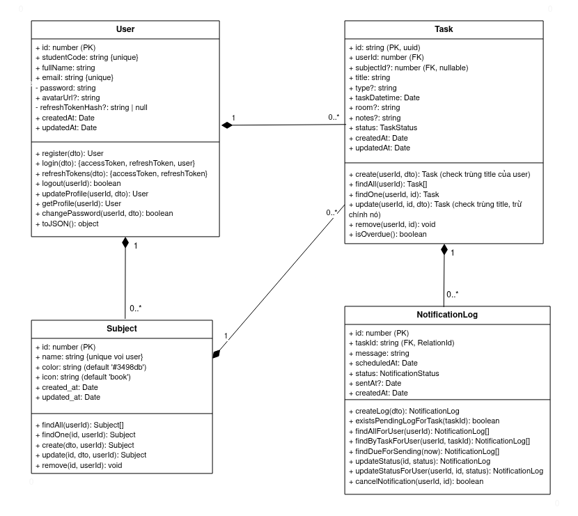
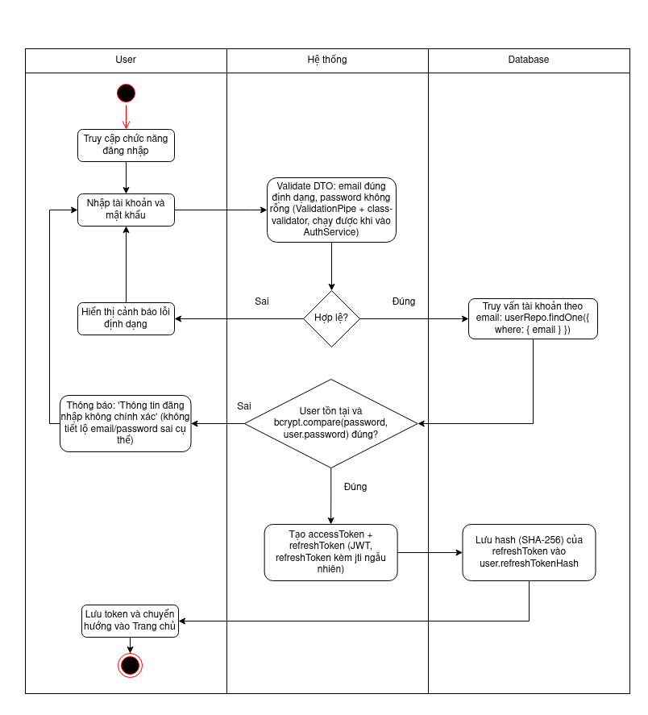
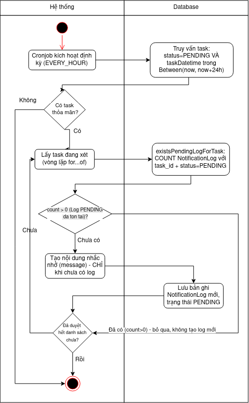
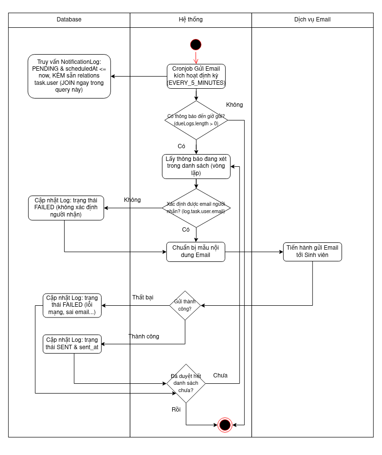
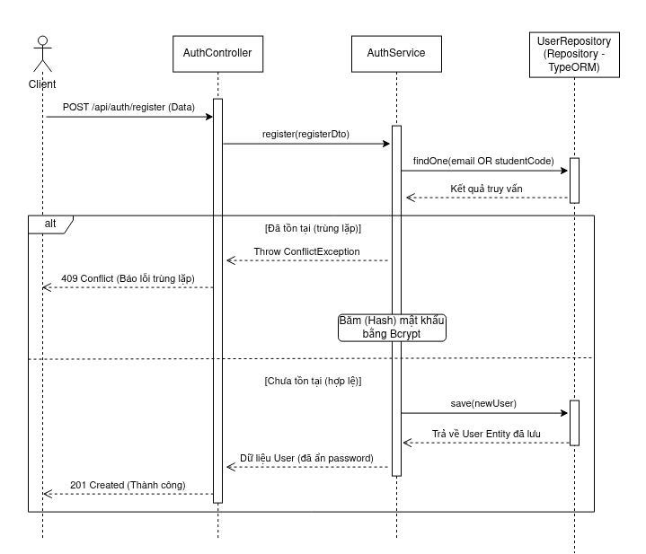
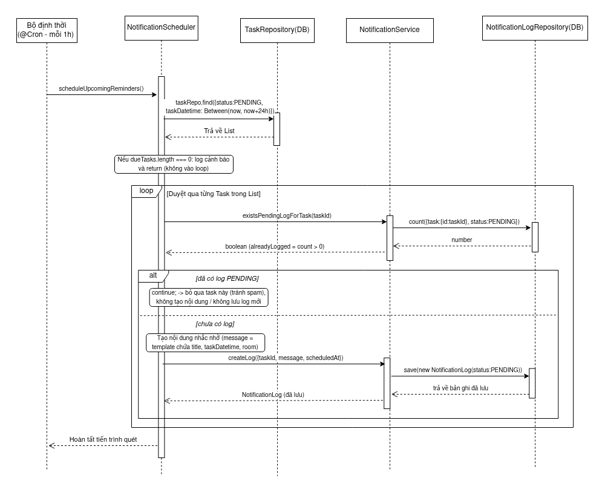

# Student Deadline Manager

Ứng dụng giúp sinh viên quản lý môn học và công việc/deadline theo từng môn, tự động nhắc nhở qua email trước khi công việc đến hạn.

## Mục lục

* [Bài toán](#bài-toán)
* [Đối tượng nghiệp vụ chính](#đối-tượng-nghiệp-vụ-chính)
* [Chức năng chính](#chức-năng-chính)
* [Các sơ đồ](#các-sơ-đồ)
* [Công nghệ sử dụng](#công-nghệ-sử-dụng)
* [Cấu trúc dự án](#cấu-trúc-dự-án)
* [Cài đặt và chạy thử](#cài-đặt-và-chạy-thử)
* [Biến môi trường (Backend)](#biến-môi-trường-backend)
* [Tài liệu API](#tài-liệu-api)
* [Kiểm thử](#kiểm-thử)

## Bài toán

Sinh viên trong quá trình học thường phải theo dõi nhiều loại công việc có deadline khác nhau (bài tập, đồ án, lịch thi, lịch nộp báo cáo...) trải đều trên nhiều môn học. Việc quên deadline ảnh hưởng trực tiếp đến kết quả học tập. Dự án xây dựng một hệ thống giúp sinh viên:

* Quản lý danh sách môn học đang theo học.
* Quản lý công việc/deadline gắn với từng môn học.
* Tự động lên lịch và gửi email nhắc nhở trước khi công việc đến hạn.

## Đối tượng nghiệp vụ chính

* **User (Sinh viên)**: tài khoản đăng nhập hệ thống.
* **Subject (Môn học)**: các môn học mà sinh viên đang theo học, có màu sắc và icon riêng để phân biệt.
* **Task (Công việc/Deadline)**: công việc gắn với 1 môn học, có hạn hoàn thành và trạng thái.
* **NotificationLog (Nhắc nhở)**: bản ghi nhắc nhở được tự động lên lịch và gửi qua email.

## Chức năng chính

**Quản lý tài khoản**

* Đăng ký bằng email và mã sinh viên.
* Đăng nhập bằng email/mật khẩu, xác thực bằng JWT (access token + refresh token).
* Cập nhật hồ sơ cá nhân (họ tên, ảnh đại diện), đổi mật khẩu.

**Quản lý môn học**

* Thêm/sửa/xóa môn học kèm màu sắc và icon riêng.
* Xem danh sách môn học.

**Quản lý công việc/deadline**

* Tạo công việc gắn với 1 môn học, kèm hạn hoàn thành.
* Cập nhật trạng thái công việc (đang làm / hoàn thành / hủy).
* Tự động xác định công việc quá hạn dựa trên thời gian hiện tại.

**Quản lý nhắc nhở**

* Tự động quét và tạo nhắc nhở cho công việc sắp đến hạn (cronjob chạy định kỳ).
* Tự động gửi email nhắc nhở đúng thời điểm đã lên lịch.
* Cho phép hủy một nhắc nhở đã lên lịch.

**Lịch (Calendar)**

* Xem công việc/deadline trực quan trên bộ lịch theo tuần/tháng.
* Màu sắc công việc trên lịch đồng bộ với màu của môn học.
* Bấm vào một ngày để xem chi tiết hoặc thêm nhanh công việc mới

## Các sơ đồ

<details>
<summary>Hình 3.1: Class Diagram tổng thể hệ thống</summary>



</details>

<details>
<summary>Hình 3.2: Activity Diagram — Đăng nhập tài khoản</summary>



</details>

<details>
<summary>Hình 3.3: Activity Diagram — Lập lịch nhắc nhở</summary>



</details>

<details>
<summary>Hình 3.4: Activity Diagram — Cronjob gửi email nhắc nhở </summary>



</details>

<details>
<summary>Hình 3.5: Sequence Diagram — Đăng ký tài khoản</summary>



</details>

<details>
<summary>Hình 3.6: Sequence Diagram - Tiến trình quét và lên lịch nhắc nhở</summary>



</details>

## Công nghệ sử dụng

**Backend**

* NestJS 11 (Node.js, kiến trúc phân lớp Module - Controller - Service - Repository)
* TypeORM + MySQL (cơ sở dữ liệu quan hệ)
* SQLite (sql.js, better-sqlite3) - dùng khi chạy unit test/e2e test
* Passport + passport-jwt, @nestjs/jwt - xác thực JWT
* bcrypt - băm mật khẩu
* class-validator, class-transformer - validate DTO
* @nestjs/throttler - giới hạn số lần gọi API (chống brute-force)
* @nestjs/schedule - lập lịch cronjob
* Nodemailer - gửi email
* Swagger/OpenAPI - tài liệu API
* Jest, Supertest - unit test và e2e test

**Frontend**

* React 19 + React Router DOM 6
* Axios - gọi API
* Bootstrap 5, React-Bootstrap, Tailwind CSS - giao diện
* Lucide React - bộ icon dùng trong giao diện ứng dụng
* React Context API - quản lý trạng thái đăng nhập toàn cục

## Cấu trúc dự án

```text
last-dance/
├── backend/
│   └── src/
│       ├── auth/            # đăng ký, đăng nhập, JWT, hồ sơ người dùng
│       ├── subjects/        # quản lý môn học
│       ├── tasks/           # quản lý công việc/deadline
│       ├── notification/    # lên lịch và gửi email nhắc nhở
│       ├── common/          # enum, filter dùng chung
│       ├── config/          # cấu hình database
│       ├── migrations/      # migration TypeORM
│       ├── types/           # khai báo type mở rộng (express-session.d.ts)
│       ├── app.module.ts    # module gốc, tổng hợp tất cả module con
│       └── main.ts          # entry point, cấu hình ValidationPipe, Swagger
├── frontend/
│   └── src/
│       ├── api/             # gọi API tới backend
│       ├── components/      # component tái sử dụng (Calendar, Modal, layout, ui...)
│       ├── context/         # AuthContext
│       ├── pages/           # các trang chính (Dashboard, Login, Register, Calendar...)
│       └── utils/
└── database/
    └── database_schema.sql  # schema cấu trúc bảng, đối chiếu với các entity TypeORM
```

## Cài đặt và chạy thử

**Backend**

```bash
cd last-dance/backend
npm install
npm run migration:run
npm run start:dev # npm run dev
```

Backend chạy tại `http://localhost:3000`.

**Frontend**

```bash
cd last-dance/frontend
npm install
npm start # npm run dev
```

Frontend chạy tại `http://localhost:3000` (hoặc cổng khác nếu backend đã chiếm cổng này, kiểm tra file cấu hình proxy/API base URL).

## Biến môi trường (Backend)

Tạo file `.env` trong thư mục `backend/` với các biến cần thiết, ví dụ:

```env
PORT=3000

# Database
DB_HOST=localhost
DB_PORT=3306
DB_USERNAME=root
DB_PASSWORD=
DB_NAME=student_deadline_manager

# JWT
JWT_ACCESS_SECRET=doi-thanh-chuoi-bi-mat-cua-ban
JWT_REFRESH_SECRET=doi-thanh-chuoi-bi-mat-khac
JWT_ACCESS_EXPIRES=15m
JWT_REFRESH_EXPIRES=7d

# Email (SMTP)
SMTP_HOST=smtp.gmail.com
SMTP_PORT=587
SMTP_USER=email-cua-ban@gmail.com
SMTP_PASS=app-password-cua-ban
SMTP_FROM=no-reply@sdm.edu.vn
```

## Tài liệu API

Sau khi chạy backend, mở Swagger UI tại:

```text
http://localhost:3000/api/docs
```

Có thể bấm nút **"Authorize"** và dán **accessToken** (không cần gõ chữ **"Bearer"**) để test trực tiếp các API cần đăng nhập.

## Kiểm thử

```bash
cd last-dance/backend

npm run test        # unit test
npm run test:e2e    # test e2e
npm run test:cov    # test kèm báo cáo coverage
```

